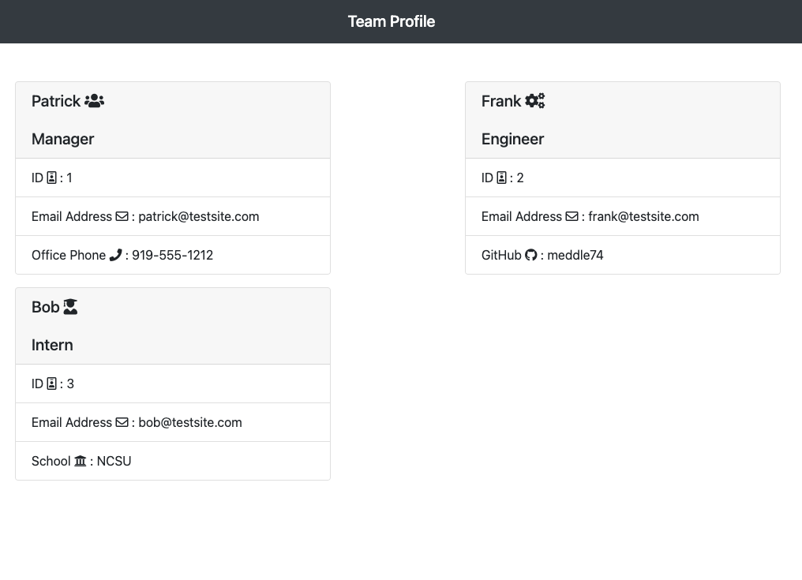

# **Team Profile Generator**

## Description 
Created a node application that will generate an html file with your team members information.  When you have completed building the team, the application will create an HTML file that displays a nicely formatted team roster based on the information provided.
## Table of contents
- [Description](#Description)
- [Installation](#Installation)
- [Usage](#Usage)
- [Licence](#Licence)
- [Repository Link](#Repository)
- [GitHub Info](#GitHub) 

## Screenshots

## Installation
        npm install
## Usage
        Run npm install and then run create.js
## Licence
MIT
## Repository
- [Team Profile Generator Repo](https://github.com/meddle74/teamProfileGenerator)
## GitHub
- Email: jpatricklloyd@icloud.com
- [GitHub Profile](https://github.com/Meddle74)
